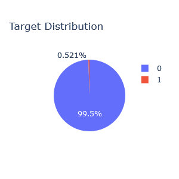
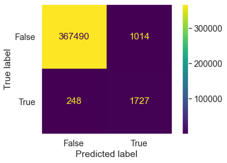
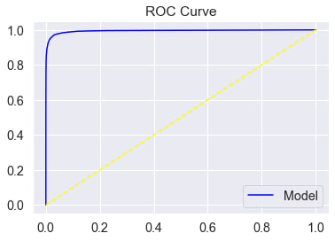
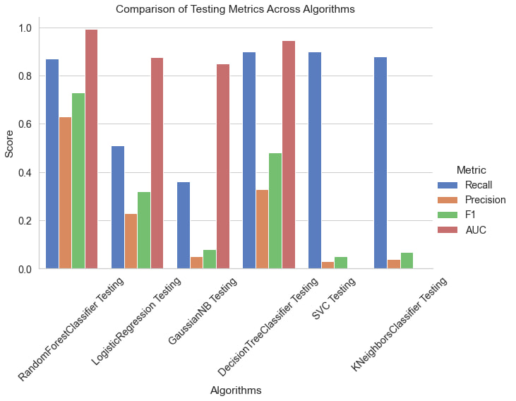

# Credit Card Transactions Fraud Detection

[Dataset on kaggle](https://www.kaggle.com/datasets/kartik2112/fraud-detection)

## Contents
### Data Understanding
* Features
* Null values detection
* Duplicated values detection 

### Data Cleaning For EDA
* Column removal
* Discretization
* Creating new features
* Feature extraction

### Feature Engineering
* Datetime feature extraction
* Credit card feature extraction

### Exploratory Data Analysis
* Univariate Analysis
  * Target
  * Categorical features
  * Numerical features

* Bivariate Analysis
  * Target analysis
  * Amount of activity analysis
  * Time analysis

### Correlation and Association Analysis
* Correlation matrix 
* Association matrix

### Data Preprocessing
* Column removal
* Log transform
* Categorical encoding
  * Binary encoding
  * Weight of evidence encoding
  * Ordinal encoding

* Train-test split

### Imbalanced Learning
Target is imbalanced
* 

Methods performed
* No changes
* Random under sampling
* Random over sampling
* SMOTE-Tomek links
* Class weights

### Feature Importance

### Modeling
1. Random Forest Classifier
2. Logistic Regression Classifier
3. Naive Bayes
4. Decision Tree Classifier
5. Support Vector Machine (SVM) Classifier
6. K-nearest neighbor (KNN) Classifier

### Evaluation
* Confusion matrix
* AUC curve
* Classification metrics
* Decision boundary

Results on random forest classifier for test data

### Model Selection
Results on all models for test data

